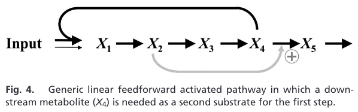
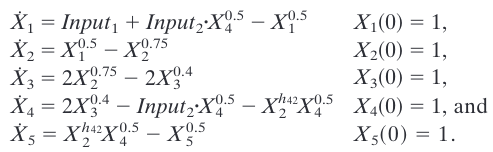
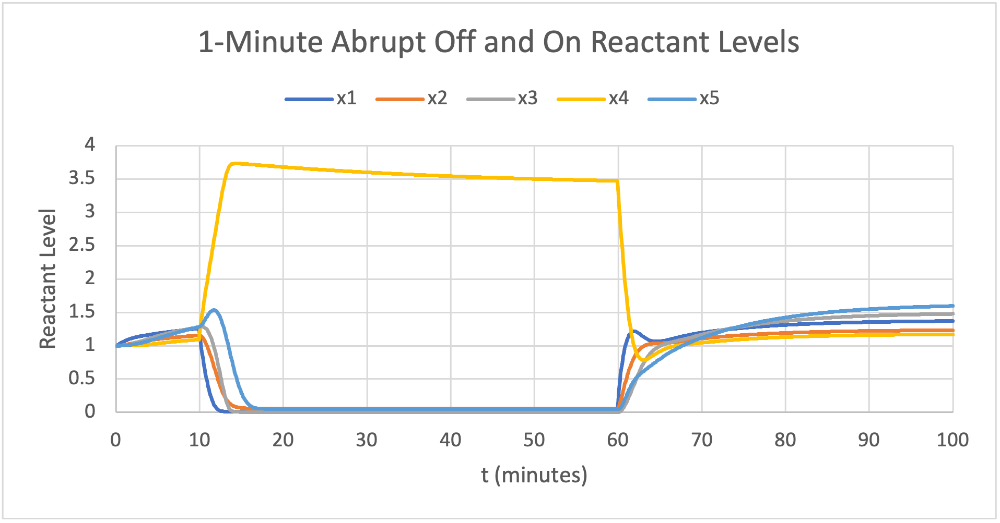

# reaction-network-analysis
This is a project to simulate a simple biochemical reaction network I found in the following paper:

> 1. Voit, E., Neves, A. R. & Santos, H. The intricate side of systems biology. Proc. Natl. Acad. Sci. U.S.A. 103, 9452–9457 (2006).

doi: 10.1073/pnas.0603337103

## Network Setup

### Diagram of Network

### The Equations

From the paper:

> The system has two inputs, one that represents some low-level constant substrate supply (Input1 = 0.01), which prevents the system dynamics from ceasing altogether, whereas the other one (Input2 = 0.99) is controlled by X4. In the Lactococcus system, these inputs correspond to ATP-based and PTS-based glucose phosphorylation, respectively. The steady state of the system is (1, 1, …, 1). The parameter h42 in the conversion of X4 into X5 reflects the feedforward activation of primary interest. With the value h42 = 0.75, the system shows the response in Fig. 5A. For this time course, the system starts at its steady state. At t = 10 min, the main input is suddenly stopped (Input2 = 0). Because of this artificial suddenness, all variables except for X4 almost immediately approach a very low value that is maintained by the constant low-level input. With X2 close to zero, its activation of the degradation of X4 ceases, and X4 is produced but virtually not degraded. In comparison with the Lactococcus data, the dynamics of X4 does not show the initial decrease. This difference in response is due to simplifications in the artificial pathway. Of main importance is that upon restoration of Input2 at t = 60, the system is immediately ready to resume activity.

### Default Trajectory for the System

Under the conditions stated above, the time evolution of reactant concentration should look like:

